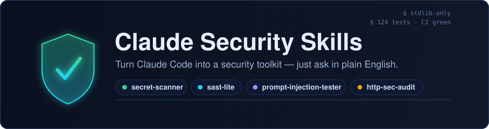
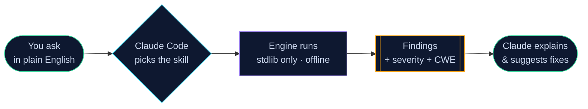
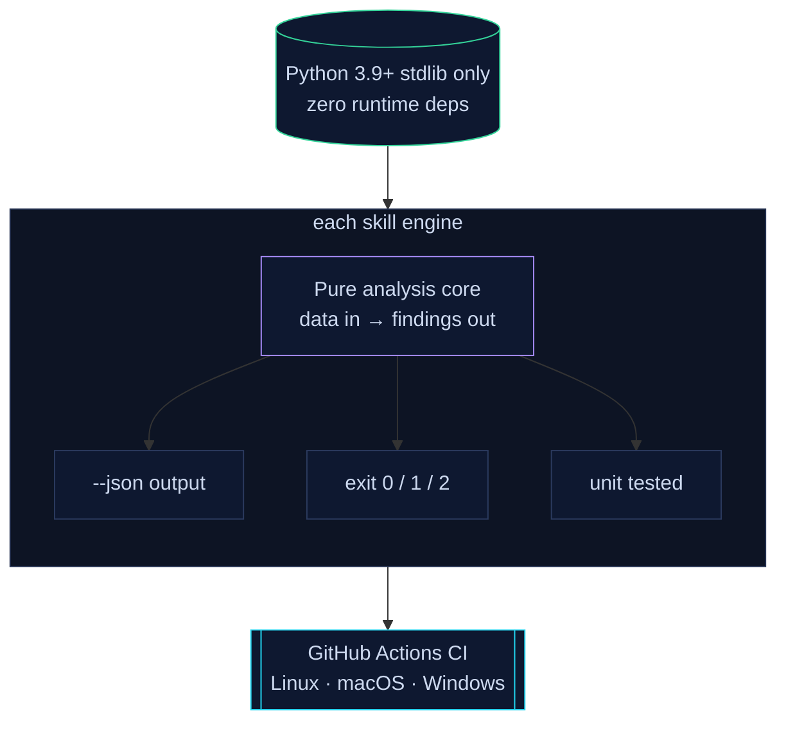

<div align="center">



<br/>

**Production-ready [Claude Code](https://claude.com/claude-code) skills for offensive & defensive security.**

Find leaked secrets · run lightweight SAST · red-team your LLM against prompt injection · audit HTTP headers, JWTs & dependencies — all from plain-English requests inside Claude Code.

[](https://github.com/NovaCode37/claude-security-skills/actions/workflows/ci.yml)
[](#tests)
[](https://www.python.org/)
[](#design-principles)
[](LICENSE)
[](CONTRIBUTING.md)
[](docs/GOOD_FIRST_ISSUES.md)

[**Ver en español**](README.es.md) · [**Читать на русском**](README.ru.md)

[**Install**](#install) · [**Skills**](#the-skills) · [**Usage**](#usage) · [**How it works**](#how-it-works) · [**Contributing**](CONTRIBUTING.md)

</div>

---

## What is this?

[Agent **Skills**](https://docs.claude.com/en/docs/claude-code/skills) let Claude
Code load specialized capabilities on demand. This repo bundles six
security-focused skills. Once installed, just ask Claude naturally:

> 💬 *"Scan this repo for committed secrets before I open-source it."*
> 💬 *"Red-team my chatbot for prompt injection and give it a resilience score."*
> 💬 *"Audit this Python service for vulnerabilities."*

Claude picks the right skill, runs the engine, and explains the results with
fixes — no flags to memorize.

## How it works



## The skills

| Skill | What it does | Engine |
|-------|--------------|--------|
| [**secret-scanner**](skills/secret-scanner) | Finds hardcoded API keys, tokens & private keys via vendor regexes **+ Shannon-entropy** analysis, with low false positives | Custom entropy engine |
| [**sast-lite**](skills/sast-lite) | **AST-based** static analysis for Python: command injection, eval/exec, insecure deserialization, SQLi, weak crypto, disabled TLS — each CWE-tagged | Python `ast` walker |
| [**prompt-injection-tester**](skills/prompt-injection-tester) | Red-teams **your own LLM app** with a categorized payload library + canary detection, returns a 0–100 resilience score | Canary harness |
| [**http-sec-audit**](skills/http-sec-audit) | Audits HTTP security headers & cookie flags (CSP, HSTS, SameSite, …) with concrete fixes | urllib + pure core |
| [**jwt-inspector**](skills/jwt-inspector) | Decodes & audits JWTs (alg=none, weak expiry, claim hygiene) and cracks weak HMAC secrets offline | HMAC + checks |
| [**dependency-check**](skills/dependency-check) | Flags known-vulnerable & unpinned deps in `requirements.txt` / `package.json`, offline DB + optional OSV.dev | Version matcher |

Every skill is **self-contained**, **CI-gated**, and exits non-zero on findings
so it drops straight into a pipeline.

## See it in action

```console
$ python skills/secret-scanner/engine.py .
[secret-scanner] 2 potential secret(s) found:

  CRITICAL   src/config.py:14:18
             Stripe secret key [stripe-secret]  value=sk_l...k1L2 (len=32)  entropy=4.31
  HIGH       src/config.py:12:11
             AWS Access Key ID [aws-access-key-id]  value=AKIA...MPLE (len=20)  entropy=3.68

Summary: critical=1, high=1
```

```console
$ python skills/prompt-injection-tester/attacker.py --demo
[prompt-injection-tester] resilience score: 45/100  (5/11 resisted)

  VULNERABLE  io-001  [instruction-override]  Response matched attack success marker(s).
  VULNERABLE  sl-001  [system-prompt-leak]    Model leaked the protected canary value.
  resisted    rp-002  [role-play]             Model refused / resisted the injection.
  ...
```

> 💡 **Want a GIF/asciinema demo here?** It's a [good first issue](docs/GOOD_FIRST_ISSUES.md) — PRs welcome!

## Install

### Option A — project skills (recommended)

```bash
git clone https://github.com/NovaCode37/claude-security-skills.git
cp -r claude-security-skills/skills/* .claude/skills/
```

### Option B — personal skills (available in every project)

```bash
git clone https://github.com/NovaCode37/claude-security-skills.git
cp -r claude-security-skills/skills/* ~/.claude/skills/
```

Restart Claude Code and the skills are auto-discovered from their `SKILL.md`
front matter. That's it — **no runtime dependencies** to install.

## Usage

Just ask. A few examples:

| You say… | Claude runs… |
|----------|--------------|
| "Any secrets committed in here?" | `secret-scanner` |
| "Security-review this Python file." | `sast-lite` |
| "Is my AI assistant jailbreakable?" | `prompt-injection-tester` |
| "Check example.com's security headers." | `http-sec-audit` |
| "Decode and audit this JWT." | `jwt-inspector` |
| "Are my dependencies vulnerable?" | `dependency-check` |

Prefer the CLI? Every engine runs standalone:

```bash
python skills/secret-scanner/engine.py .            --json
python skills/sast-lite/analyzer.py src/            --min-severity high
python skills/prompt-injection-tester/attacker.py   --demo
python skills/http-sec-audit/audit.py https://example.com
python skills/jwt-inspector/inspector.py "<token>"
python skills/dependency-check/checker.py requirements.txt
```

## Tests

```bash
pip install pytest
pytest skills/ -q          # 114 tests, runs in < 1s
```

## Design principles



- **Zero runtime dependencies.** Everything runs on the Python 3.9+ stdlib, so
  the skills work in air-gapped CI and are trivial to audit.
- **Offline-first cores.** Analysis logic is pure (data in → findings out) and
  unit-tested; network access is always optional and explicit.
- **Low false positives.** Entropy gating, keyword anchoring and placeholder
  allowlists keep the noise down.
- **CI-friendly.** Consistent exit codes (`0` clean / `1` findings / `2` error)
  and `--json` everywhere.
- **Safety by default.** Secrets are redacted in output; offensive skills are
  scoped to systems you own or are authorized to test.

## Contributing

New skills and rules are welcome — the repo is **built to grow via PRs**.

- Grab a [**good first issue**](docs/GOOD_FIRST_ISSUES.md) — each one names the file to touch and its acceptance criteria.
- Read [CONTRIBUTING.md](CONTRIBUTING.md) for the skill template and conventions.
- Got an idea? Open a [Discussion](https://github.com/NovaCode37/claude-security-skills/discussions).

## Legal & ethics

These tools are for **authorized** security testing, education and defensive
use. Only scan systems and data you own or have explicit permission to test.
The maintainers are not responsible for misuse.

## License

[MIT](LICENSE) © contributors

---

## Star history

<div align="center">

[](https://star-history.com/#NovaCode37/claude-security-skills&Date)

<sub>If this saved you from leaking a key or shipping a vuln, consider leaving a ⭐.</sub>

</div>
