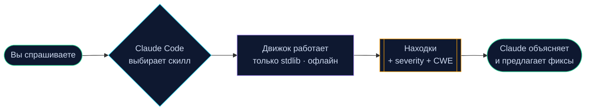

# Claude Security Skills

<div align="center">


<br/>

**Готовые к продакшену скиллы [Claude Code](https://claude.com/claude-code) для наступательной и оборонительной безопасности.**

Находите утёкшие секреты, запускайте лёгкий SAST, тестируйте свой LLM на prompt injection, проверяйте HTTP-заголовки, JWT и зависимости — всё обычными запросами на естественном языке внутри Claude Code.

[](https://github.com/NovaCode37/claude-security-skills/actions/workflows/ci.yml)
[](#тесты)
[](https://www.python.org/)
[](#принципы-дизайна)
[](LICENSE)
[](CONTRIBUTING.md)

[**English**](README.md) · [**Español**](README.es.md)

[**Установка**](#установка) · [**Скиллы**](#скиллы) · [**Использование**](#использование) · [**Как это работает**](#как-это-работает) · [**Контрибьютинг**](CONTRIBUTING.md)

</div>

---

## Что это?

[Agent **Skills**](https://docs.claude.com/en/docs/claude-code/skills) позволяют Claude Code подгружать специализированные возможности по требованию. Этот репозиторий собирает шесть скиллов по безопасности. После установки просто попросите Claude:

> 💬 *«Просканируй этот репозиторий на закоммиченные секреты перед публикацией.»*
> 💬 *«Прогони мой чат-бот на prompt injection и дай оценку устойчивости.»*
> 💬 *«Проверь этот Python-сервис на уязвимости.»*

Claude сам выбирает нужный скилл, запускает движок и объясняет результаты с рекомендациями по исправлению — никаких флагов запоминать не надо.

## Как это работает



## Скиллы

| Скилл | Что делает | Движок |
|-------|------------|--------|
| [**secret-scanner**](skills/secret-scanner) | Находит зашитые API-ключи, токены и приватные ключи через вендорные регэкспы **+ анализ энтропии Шеннона**, с низким числом ложных срабатываний | Свой движок энтропии |
| [**sast-lite**](skills/sast-lite) | **Статический анализ на основе AST** для Python: инъекция команд, eval/exec, небезопасная десериализация, SQLi, слабая криптография, отключённый TLS — каждый с тегом CWE | Обход AST Python |
| [**prompt-injection-tester**](skills/prompt-injection-tester) | Red-team **вашего собственного LLM-приложения**: категоризированная библиотека пейлоадов + детект канарейки, оценка устойчивости 0–100 | Canary-харнесс |
| [**http-sec-audit**](skills/http-sec-audit) | Аудит HTTP security-заголовков и флагов cookie (CSP, HSTS, SameSite, …) с конкретными фиксами | urllib + чистое ядро |
| [**jwt-inspector**](skills/jwt-inspector) | Декодирует и аудитит JWT (alg=none, слабый expiry, гигиена claims) и офлайн подбирает слабые HMAC-секреты | HMAC + проверки |
| [**dependency-check**](skills/dependency-check) | Отмечает уязвимые и незапиненные зависимости в `requirements.txt` / `package.json` / `pyproject.toml`, офлайн-база + опционально OSV.dev | Сопоставление версий |

Каждый скилл **самодостаточен**, **покрыт CI** и завершается с ненулевым кодом при находках — встраивается прямо в пайплайн.

## Установка

### Вариант A — скиллы проекта (рекомендуется)

```bash
git clone https://github.com/NovaCode37/claude-security-skills.git
cp -r claude-security-skills/skills/* .claude/skills/
```

### Вариант B — личные скиллы (доступны в каждом проекте)

```bash
git clone https://github.com/NovaCode37/claude-security-skills.git
cp -r claude-security-skills/skills/* ~/.claude/skills/
```

Перезапустите Claude Code — скиллы автоматически обнаружатся по front matter в их `SKILL.md`. И всё — **никаких зависимостей** ставить не нужно.

## Использование

Просто попросите. Несколько примеров:

| Вы говорите… | Claude запускает… |
|--------------|-------------------|
| «Тут есть закоммиченные секреты?» | `secret-scanner` |
| «Проверь этот Python-файл на безопасность.» | `sast-lite` |
| «Мой ИИ-ассистент джейлбрейкается?» | `prompt-injection-tester` |
| «Проверь security-заголовки example.com.» | `http-sec-audit` |
| «Декодируй и проверь этот JWT.» | `jwt-inspector` |
| «Мои зависимости уязвимы?» | `dependency-check` |

Предпочитаете CLI? Каждый движок запускается standalone:

```bash
python skills/secret-scanner/engine.py .            --json
python skills/sast-lite/analyzer.py src/            --min-severity high
python skills/prompt-injection-tester/attacker.py   --demo
python skills/http-sec-audit/audit.py https://example.com
python skills/jwt-inspector/inspector.py "<token>"
python skills/dependency-check/checker.py requirements.txt
```

## Тесты

```bash
pip install pytest
pytest skills/ -q
```

## Принципы дизайна

- **Ноль зависимостей в рантайме.** Всё работает на стандартной библиотеке Python 3.9+, поэтому скиллы запускаются в air-gapped CI и легко аудируются.
- **Офлайн-first ядро.** Логика анализа чистая (данные на вход → находки на выход) и покрыта юнит-тестами; доступ к сети всегда опционален и явный.
- **Мало ложных срабатываний.** Порог энтропии, привязка к ключевым словам и allowlist'ы плейсхолдеров снижают шум.
- **Дружелюбен к CI.** Согласованные коды выхода (`0` чисто / `1` находки / `2` ошибка) и `--json` везде.
- **Безопасность по умолчанию.** Секреты редактируются в выводе; наступательные скиллы применяются только к системам, которыми вы владеете или имеете разрешение тестировать.

## Контрибьютинг

Новые скиллы и правила приветствуются — репозиторий создан, чтобы расти через PR.

- Возьмите [**good first issue**](docs/GOOD_FIRST_ISSUES.md) — в каждой указан файл и критерии приёмки.
- Прочитайте [CONTRIBUTING.md](CONTRIBUTING.md) — шаблон скилла и соглашения.
- Есть идея? Откройте [Discussion](https://github.com/NovaCode37/claude-security-skills/discussions).

## Право и этика

Эти инструменты предназначены для **авторизованного** тестирования безопасности, обучения и защиты. Сканируйте только те системы и данные, которыми владеете или на тест которых есть явное разрешение. Сопровождающие не несут ответственности за злоупотребление.

## Лицензия

[MIT](LICENSE) © contributors
